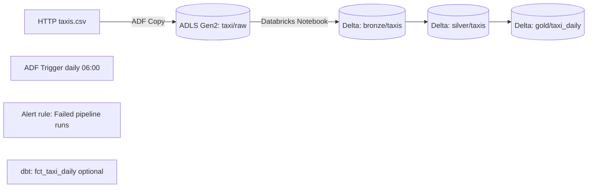

# ADF → ADLS Gen2 → Databricks (Delta) + Schedule + Alerts

**One-day, end-to-end Azure data pipeline** that lands a public taxi CSV in **ADLS Gen2**, transforms it in **Databricks** to **Delta Bronze/Silver/Gold**, and adds **daily scheduling**, **monitoring/alerts**, and **GitHub Actions** deploys. Secrets are handled with **Databricks Secret Scopes** + **OAuth** (no hard-coding).

## Stack
Azure Data Factory • ADLS Gen2 • Azure Databricks (Delta) • GitHub Actions • dbt (optional)

## Architecture


## What this proves for the JD

✅ **ADF orchestration** with parameters → ADLS landing  
✅ **Databricks notebook** transforms with Delta Bronze/Silver/Gold  
✅ **Schedule** (daily trigger) and **alert rule** on failed runs  
✅ **Secure storage access** via OAuth + Secret Scope (no keys in code)  
✅ **Git versioning & CI**: notebook imported to `/Shared/bronze_silver` on push  
✅ **(Optional) dbt mart** + tests  

## How to run (reproduce quickly)

### ADF: pipeline `pl_ingest_transform`

**Parameters**
- `source_url` (default) `https://raw.githubusercontent.com/mwaskom/seaborn-data/master/taxis.csv`
- `date_str` (default) `@{formatDateTime(utcnow(),'yyyyMMdd')}`

**Activities**: `CopyHttpToAdls` → `RunBronzeSilver` (`/Shared/bronze_silver`)  
**Trigger**: daily 06:00

### Databricks cluster Spark config (OAuth to ADLS):

```
spark.hadoop.fs.azure.account.auth.type.sttaxistorage.dfs.core.windows.net OAuth
spark.hadoop.fs.azure.account.oauth.provider.type.sttaxistorage.dfs.core.windows.net org.apache.hadoop.fs.azurebfs.oauth2.ClientCredsTokenProvider
spark.hadoop.fs.azure.account.oauth2.client.id.sttaxistorage.dfs.core.windows.net {{secrets/adls-oauth/app-id}}
spark.hadoop.fs.azure.account.oauth2.client.secret.sttaxistorage.dfs.core.windows.net {{secrets/adls-oauth/app-secret}}
spark.hadoop.fs.azure.account.oauth2.client.endpoint.sttaxistorage.dfs.core.windows.net https://login.microsoftonline.com/9eb4939d-921a-44d3-aa4c-2b1512e5743a/oauth2/token
```

*(Tenant GUID is not secret; id/secret come from the `adls-oauth` secret scope.)*

### Paths
- **Raw**: `abfss://taxi@sttaxistorage.dfs.core.windows.net/raw/`
- **Delta base**: `abfss://taxi@sttaxistorage.dfs.core.windows.net/delta/`
- **Tables**: `bronze/taxis`, `silver/taxis`, `gold/taxi_daily`

**CI/CD**: GitHub Action imports notebook to `/Shared/bronze_silver` on push.

## Data quality & Medallion

- **Silver** casts/cleans + normalizes `payment_type` (Cash/Credit/Other).
- **DQ toggle**: `STRICT_DQ=True` to fail the notebook (useful to demo alerts) or `False` to warn.
- **Gold** aggregates daily metrics by `pickup_date` & `payment_type`.

### Results (from latest run)
- **Bronze**: 6,433 rows
- **Silver**: 6,382 rows  
- **Gold**: 89 rows

## Screenshots

Each image below is captured from the live run; filenames live in `adf-dbx-delta/images/`.

### Linked services


### Pipeline canvas


### Monitor – failed (alert demo)


### Monitor – succeeded


### Daily trigger


### ADLS raw landing


### Databricks – bronze/silver/gold row counts


### GitHub Actions – deploy success
